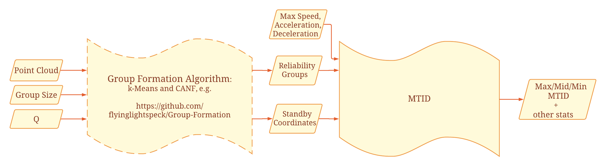
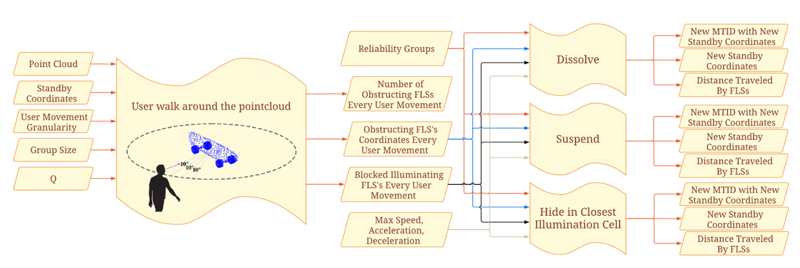

# Standby Flying Light Specks

This repository contains software that models deployment and failure handling of FLSs using standbys.

Authors:  Hamed Alimohammadzadeh(halimoha@usc.edu), Shuqin Zhu (shuqinzh@usc.edu), and Shahram Ghandeharizadeh (shahram@usc.edu)

# Features
   * An FLS velocity model consisting of adjustable acceleration, deceleration, and speed parameters.
   * Two FLS failure models:  RandTTL using a uniform distribution and BetaTTL using a skewed distribution.
   * Fix-sized reliability groups consisting of G illuminating FLSs and 1 standby FLSs.
   * Mean Time to Illuminate a Dark (MTID) point after an illuminating FLS fails.  Visualize results by generating png files in `./assets/figures`.
   * Both illuminating and standby FLSs may fail either mid-flight to their destination or once at their destination.
   * A configurable simulation model to quantify the Quality of Illumination (QoI) as a function of time for a point cloud.  Each FLS is modeled as a process.  With large point cloudes (FLSs), the simulator scales horizontally to run across multiple servers.
   * Detection of obstructing dark standby FLSs.
   * Two techniques to eliminate dark standby FLSs from obstructing the user field of view:  Dissolve and Suspend.
   * Visualizes results by providing a histogram of the group sizes, box plot of distance from the center of a group to the group members, average distance from a dispatcher to group centroid

# Limitations
   * In general, a reliability group may consist of C standby FLSs.  The current implmentation supports C=1 only.
   * We consider the field of view of only one user.

# Clone
`git clone https://github.com/flslab/FailureHandling.git`

# Running using Venv
This software was implemented and tested using Python 3.9.0.

We recommend using PyCharm, enabling the software to run across mutliple operating systems, e.g., Windows, MacOS, etc.

Use the `bash setup_venv.sh` to create and activate a virtual environment or alternatively follow these steps to set it up manually.
First create a virtual environment using venv. 
You can use any name instead of env.

``
cd StandbyFLSs
python3.9 -m venv env
``

Then, activate the virtual environment.

``
source env/bin/activate
``

On windows use the following instead:

``
env/Scripts/activate.bat //In CMD
env/Scripts/Activate.ps1 //In Powershel
``

You can deactivate the virtual environment by running `deactivate` in the terminal.


## Set Up Local
Run `bash setup.sh` to set up everything.

If anything went wrong with the bash command, simply run `pip3 install -r requirements.txt` in the root directory. If you are using IDE like PyCharm, you can download all the requirements with it.
We recommend the use of PyCharm for running this software on a single laptop or server for evaluation purposes.
By installing and using PyCharm, the single server version of software will execute on a wide range of operating systems ranging from macOS to Windows.  


# MTID
The program `./utils/mtid.py` implements analytical models to compute the MTID for a collection of 3D point clouds (shapes) with different reliability groups.  
The reliability groups may be computed using an algorithms such as k-Means or CANF.  
More formally, `./utils/mtid.py` assumes:
   * A text file that describes the 3D coordinates of a point cloud.  We provide several point clouds in `./assets/pointcloud`: dragon.txt, hat.txt, and skateboard.txt.  The variable `shapes` defines the point clouds that the program iterates.
   * A .xlsx file that describes a reliability group computed for a shape using a grouping algorithm with a pre-specified group size.  The name of a file is [shape]\_[grouping algorithm]\_[group size].xlsx.  `shape` is from the previous bullet, a user specified identifier for a grouping algorithm, e.g., `K` for k-Means, a value for group size, e.g., 3.  In `./assets/pointcloud`, we provide files for the alternative shapes of the previous bullet, K-Means and CANF, and group sizes of {3, 5, 10, 20}.  These files were computed separately and placed in the `./assets/pointcloud` for use by `./utils/mtid.py`.  They ensure MTID is independent of an algorithm that computes a reliability group, enabling its application to all possible grouping algorithms.
     (Group Centroids, where standby FLSs should be positioned, are calculated using the reliability groups from this file)

The output of executing `./utils/mtid.py` includes:
   * `./assets/mtid_report.csv` contains the minimum, median, and maximum MTID.  It also computes other essential stats such as the minimum, median, and maximum distance of a standby at the center of a group to each group member. This information is reported for each shape, grouping algorithm, and group size.  This is a row of `./assets/mtid_report.csv` file.
   * `./assets/figures` contains a listing of figures for the different shapes, grouping algorithms, and group sizes.  These figures show MTID, a histogram of group sizes constructed by a grouping algorithm, among others.



## Run Local

The variables specified in `config.py` control settings. Once these are adjusted (see below), run:

`python3 primary.py`

After the notification "INFO - Waiting for secondary nodes to connect" shows, run:

`python3 secondary.py`

Need to notice that the result output path is also an adjustable configuration.

## Set Up and Run on Cloud Lab
First, set up a cluster of servers. Creat a cloudlab profile using the file `profile.py`, then start your own experiments with any chosen type of nodes. 
Ideally, the total number of cores of the servers should equal or be greater than the number of points in the point cloud (number of FLSs).
Otherwise, the lack of cores may cause incorrect results. Normally, when the accessible resource is limited, one core for 2 to 4 points will also work. 
 
After setting up cloudlab, modify the following files based on comment:

* `gen_conf_cluster`: Identify the path where the gen_conf.py lies
* `cloudlab_vars.sh`： set the number of nodes 
* `constants.py`: Set broadcast address and port

Change the configuration for experiments in `gen_conf.py`, this will be the base script to generate configure for each experiment.
Once it's settle, checkout the number of total configurations, and change the number in the For Loop to `the total configuration sets - 1`.
The system will traverse all these configuration sets.

Finally, modify the script `decentralized_gen.sh` following the comment just like previous files. Then run the script to clone the
project and setup on cloudlab (See section above).

Run `bash setup.sh` to set up the project.

After all above are done, run `bash nohup_run.sh` on the primary node (node with index 0). Use `tail -f my.log` to trace output in the root directory.

To stop the running process, run the `sudo pkill python3` command in `decentralized_gen.sh`, then run `nohup_kill.sh` on
the primary node.

## Experiment Report

The final report will be generated in a folder named with the experiment configuration, under the result path directory.
A report will include 3 data sheets:
 * Metrics
 * Config
 * Dispatcher

The Metric sheet includes all the reporting information, detailed description shown blown:

| Term                                                    | Definition                                                                                                                                                                                               |
|:--------------------------------------------------------|:---------------------------------------------------------------------------------------------------------------------------------------------------------------------------------------------------------|
| QoI before Reset                                        | Percentage of illuminating FLSs defined as the number of illuminating FLSs divided by the total number of required FLSs (points in a point cloud).  Measured once all initial FLSs have been dispatched. |
| QoI after Reset                                         | Same as above, but measured at the end of the experiment                                                                                                                                                 |
| Dispatched Before Reset                                 | Number of FLSs dispatched before all initial illuminating and initial standby FLSs were dispatched                                                                                                       |
| Dispatched After Reset                                  | Number of FLSs dispatched after all initial illuminating and initial standby FLSs were dispatched                                                                                                        |
| Failure Before Reset                                    | Number of failed FLSs before all initial illuminating and initial standby FLSs were dispatched                                                                                                           |
| Failure After Reset                                     | Number of failed FLSs after all initial illuminating and initial standby FLSs were dispatched                                                                                                            |
| Mid-Flight                                              | Number of mid-flight FLSs at the end of the experiment                                                                                                                                                   |
| Illuminating                                            | Number of illuminating FLSs at the end of the experiment                                                                                                                                                 |
| Stationary Standby                                      | Number of stationary FLSs at the end of the experiment                                                                                                                                                   |
| Avg Travel Time                                         | Depends on the speed model, average time to travel the distance                                                                                                                                          |
| Min Travel Time                                         | Depends on the speed model, min time to travel the distance                                                                                                                                              |
| Max Travel Time                                         | Depends on the speed model, max time to travel the distance                                                                                                                                              |
| Median Travel Time                                      | Depends on the speed model, median time to travel the distance                                                                                                                                           |
| Avg Dist Traveled                                       | Average distance traveled by the dispatched FLSs                                                                                                                                                         |
| Min Dist Traveled                                       | Minimum distance traveled by the dispatched FLSs                                                                                                                                                         |
| Max Dist Traveled                                       | Maximum distance traveled by the dispatched FLSs                                                                                                                                                         |
| Median Dist Traveled                                    | Median distance traveled by the dispatched FLSs                                                                                                                                                          |
| Avg MTTR                                                | Average mean time to repair an FLS                                                                                                                                                                       |
| Min MTTR                                                | Minimum mean time to repair an FLS                                                                                                                                                                       |
| Max MTTR                                                | Maximum mean time to repair an FLS                                                                                                                                                                       |
| Median MTTR                                             | Median mean time to repair an FLS                                                                                                                                                                        |
| Deploy Rate before reset                                | The rate at which a dispatcher deploys FLSs when initiating an illumination                                                                                                                              |
| Deploy rate After Reset                                 | The rate at which a dispatcher deploys FLSs after all FLSs to illuminate a shape have been deployed                                                                                                      |
| Number of Groups                                        | Number of reliability groups                                                                                                                                                                             |
| Min_dist_arrived_illuminate                             | Minimum distance traveled by illuminating FLSs that failed after arrival (distance from dispatcher to illuminating point)                                                                                |
| Max_dist_arrived_illuminate                             | Maximum distance traveled by illuminating FLSs that failed after arrival (distance from dispatcher to illuminating point)                                                                                |
| Avg_dist_arrived_illuminate                             | Average distance traveled by illuminating FLSs that failed after arrival (distance from dispatcher to illuminating point)                                                                                |
| Median_dist_arrived_illuminate                          | Median distance traveled by illuminating FLSs that failed after arrival (distance from dispatcher to illuminating point)                                                                                 |
| Min_dist_failed_midflight_illuminate                    | Minimum distance traveled by illuminating FLSs that failed before arrival (distance from dispatcher to failure point)                                                                                    |
| Max_dist_failed_midflight_illuminate                    | Maximum distance traveled by illuminating FLSs that failed before arrival (distance from dispatcher to failure point)                                                                                    |
| Avg_dist_failed_midflight_illuminate                    | Average distance traveled by illuminating FLSs that failed before arrival (distance from dispatcher to failure point)                                                                                    |
| Median_dist_failed_midflight_illuminate                 | Median distance traveled by illuminating FLSs that failed before arrival  (distance from dispatcher to failure point)                                                                                    |
| Min_dist_stationary_standby_recover_illuminate          | Minimum distance traveled by a stationary standby to successfully recover a failed illuminating FLS                                                                                                      |
| Max_dist_stationary_standby_recover_illuminate          | Maximum distance traveled by a stationary standby to successfully recover a failed illuminating FLS                                                                                                      |
| Avg_dist_stationary_standby_recover_illuminate          | Average distance traveled by a stationary standby to successfully recover a failed illuminating FLS                                                                                                      |
| Median_dist_stationary_standby_recover_illuminate       | Median distance traveled by a stationary standby to successfully recover a failed illuminating FLS                                                                                                       |
| Min_dist_midflight_standby_recover_illuminate           | Minimum distance traveled by a mid-flight standby to successfully recover a failed illuminating FLS                                                                                                      |
| Max_dist_midflight_standby_recover_illuminate           | Maximum distance traveled by a mid-flight standby to successfully recover a failed illuminating FLS                                                                                                      |
| Avg_dist_midflight_standby_recover_illuminate           | Average distance traveled by a mid-flight standby to successfully recover a failed illuminating FLS                                                                                                      |
| Median_dist_midflight_standby_recover_illuminate        | Median distance traveled by a mid-flight standby to successfully recover a failed illuminating FLS                                                                                                       |
| Min_dist_standby_hub_to_centroid                        | Min distance traveled by a standby from dispatcher to its group centroid everytime it successfully complete its trip                                                                                     |
| Max_dist_standby_hub_to_centroid                        | Maximum distance traveled by a standby from dispatcher to its assigned coordinate everytime it successfully complete its trip                                                                            |
| Avg_dist_standby_hub_to_centroid                        | Avg distance traveled by a standby from dispatcher to its assigned coordinate everytime it successfully complete its trip                                                                                |
| Median_dist_standby_hub_to_centroid                     | Median distance traveled by a standby from dispatcher to its assigned coordinate everytime it successfully complete its trip                                                                             |
| Min_dist_standby_hub_to_fail_before_centroid            | Min Distance traveled by a standby FLS that never arrived at its group centroid                                                                                                                          |
| Max_dist_standby_hub_to_fail_before_centroid            | Max Distance traveled by a standby FLS that never arrived at its group centroid                                                                                                                          |
| Avg_dist_standby_hub_to_fail_before_centroid            | Avg Distance traveled by a standby FLS that never arrived at its group centroid                                                                                                                          |
| Median_dist_standby_hub_to_fail_before_centroid         | Median Distance traveled by a standby FLS that never arrived at its group centroid                                                                                                                       |
| Min_dist_standby_centroid_to_fail_before_recovered      | Min distance traveled by a standby stationary FLS that moves from its group centroid to recover a failed illuminating FLS and never arrives at its destination because it fails                          |
| Max_dist_standby_centroid_to_fail_before_recovered      | Max distance traveled by a standby stationary FLS that moves from its group centroid to recover a failed illuminating FLS and never arrives at its destination because it fails                          |
| Avg_dist_standby_centroid_to_fail_before_recovered      | Avg distance traveled by a standby stationary FLS that moves from its group centroid to recover a failed illuminating FLS and never arrives at its destination because it fails                          |
| Median_dist_standby_centroid_to_fail_before_recovered   | Median distance traveled by a standby stationary FLS that moves from its group centroid to recover a failed illuminating FLS and never arrives at its destination because it fails                       |
| Ill_Recovered_By_HUB                                    | Number of failed illuminating FLSs recovered by the Hub dispatching FLSs  (the new FLS arrives at the group centroid)                                                                                    |
| Ill_Recovered_By_Standby                                | Number of failed illuminating FLSs recovered using a standby FLS (the new FLS arrives at the group centroid)                                                                                             |
| Stdby_Recovered_By_Hub                                  | Number of failed standby FLSs recovered by the Hub (the new FLS arrives at the group centroid)                                                                                                           |
| Num_FLSs_Queued                                         | Number of queued FLSs at the end of the experiment                                                                                                                                                       |
| Failed Illuminating FLS                                 | Number of Failed Illuminating FLS                                                                                                                                                                        |
| Failed Standby FLS                                      | Number of Failed Standby FLS After Reset                                                                                                                                                                 |
| Hub_Deployed_FLS                                        | Failures that have been handled by the hub After Reset                                                                                                                                                   |
| Hub_Deployed_FLS_To_Illuminate                          | Number of failed illuminating FLS that have been handled by the hub                                                                                                                                      |
| Hub_Deployed_FLS_For_Standby                            | Number of Failed standby FLS that have been handled by the hub                                                                                                                                           |

The Dispatcher sheet includes all information gathered by the primary node. 
In a Dronevision/FLS Display context, this should be the information from the orchestrator.

| Term             | Definition                                                                                  |
|:-----------------|:--------------------------------------------------------------------------------------------|
| dispatcher_coord | Array of coordinates of each dispatcher                                                     |
| num_dispatched   | Number of FLSs that has been deployed by every dispatcher                                   |
| avg_delay        | Array of Average delay for FLSs dispatched by each dispatcher After initial FLSs dispatched |
| min_delay        | Array of Min delay for FLSs dispatched by each dispatcher After initial FLSs dispatched     |
| max_delay        | Array of Max delay for FLSs dispatched by each dispatcher After initial FLSs dispatched     |
| delay_info       | Lists of delayed time for FLSs dispatched by each dispatcher After initial FLSs dispatched  |
| min_delay        | Overall Min delay for FLSs dispatched by each dispatcher After initial FLSs dispatched      |
| max_delay        | Overall max delay for FLSs dispatched by each dispatcher After initial FLSs dispatched      |
| avg_delay        | Overall average delay for FLSs dispatched by each dispatcher After initial FLSs dispatched  |

## Analytical Models
The movement of FLSs are calculated using the velocity model. We suppose all FLSs have the same maximum speed, maximum acceleration and deceleration.
FLS will start from a speed of 0, and will always accelerate to a max speed if it can.
When an FLS is approaching its destination, it will decelerate with max deceleration and come to a halt at its destination.
The velocity model can be found in `./velocity.py`.
An FLS's moving time and **MTID** (Mean time to illuminate a dark point due to FLS failure) is calculated using this model.

Once a reliability group is constructed, there will be a group centroid for standby FLS. The average distance from a group centroid 
to a group member is calculated using the average value of distances of all points to their group centroid.
The Average MTID reported were calculated using the average value of the time for a standby FLS/newly deployed FLS to recover a failed illuminating FLS.
Each of these time is the time traveled for an FLS to arrive at the illuminating point.

| Term                     | Definition                                                                                                                    |
|--------------------------|-------------------------------------------------------------------------------------------------------------------------------|
| Shape                    | Shape that is comparing with.                                                                                                 |
| Method                   | Group formation techniques used.                                                                                              |
| Group Size               | The targeting group size.                                                                                                     |
| Avg Pairwise Distance    | Average distance between points in a group.                                                                                   |
| Avg Centroid Distance    | Average distance from points in each group to their corresponding group centroid.                                             |
| Min GroupSize            | Minimum group size among all group formed. The final group size may be different from the targeting group size.               |
| Median GroupSize         | Median group size among all group formed.                                                                                     |
| Max GroupSize            | Maximum group size among all group formed.                                                                                    |
| Avg MTTR                 | Average value of time need to repair a failed illuminating FLS with its assigned standby FLS (waiting at the group centroid). |
| Min MTTR                 | Minimum value of time need to repair a failed illuminating FLS with its assigned standby FLS (waiting at the group centroid). |
| Median MTTR              | Median value of time need to repair a failed illuminating FLS with its assigned standby FLS (waiting at the group centroid).  |
| Max MTTR                 | Maximum value of time need to repair a failed illuminating FLS with its assigned standby FLS (waiting at the group centroid). |
| Min MTID                 | The time for the group that has the minimum average value for its member points to get recover by it standby FLS.             |
| Median MTID              | The time for the group that has the median average value for its member points to get recover by it standby FLS.              |
| Max MTID                 | The time for the group that has the maximum average value for its member points to get recover by it standby FLS.             |
| Avg Dist To Centroid     | Average distance from each point to its group centroid.                                                                       |
| Min Dist To Centroid     | Minimum distance from each point to its group centroid.                                                                       |
| Median  Dist To Centroid | Median distance from each point to its group centroid.                                                                        |
| Max Dist To Centroid     | Maximum distance from each point to its group centroid.                                                                       |


## Obstructing FLS **Detection**
Standby FLSs show remain dark while waiting to recover failed FLSs. Thus, it may block some other illuminating FLSs and diminish the user's immersive experience.
The program `./utils/obstructing_detection.py` implements analytical models to detect obstructing standby FLSs.  
`./utils/obstructing_detection.py` assumes:
   * User is standing 100 display cells from the boundary of the shape, looking at the shape from six views: [front, back, top, bottom, left, right]. We assume the user's eyes position is known.
   * A text file that describes the 3D coordinates of a point cloud.  We provide several point clouds in `./assets/pointcloud`: dragon.txt, hat.txt, and skateboard.txt.  The variable `shapes` defines the point clouds that the program iterates.
   * A .xlsx file that describes a reliability group computed for a shape using a grouping algorithm with a pre-specified group size. 
The name of a file is [shape]\_[grouping algorithm]\_[group size].xlsx.  `shape` is from the previous bullet, a user specified identifier for a grouping algorithm, e.g., `K` for k-Means, a value for group size, e.g., 3.  
In `./assets/pointcloud`, we provide files for the alternative shapes of the previous bullet, K-Means and CANF, and group sizes of {3, 5, 10, 20}. 
(Same as the description in Section MTID. Group Centroids, where standby FLSs should be positioned, are calculated using the reliability groups from this file)
   * Specified Illumination Cell to Display Cell Ratio, `Q`. This defined the size of an illumination Cell.

The output of executing `./utils/obstructing_detection.py` includes:
   * `./assets/Obstructing/Q[value of Q]/G[Group Size]/` contain lists of text files, that recorded coordinates all standby FLSs, coordinates of obstructing standby FLSs, coordinates of illuminating FLSs blocked by them, coordinates of standby FLSs that are visible to human eyes, and coordinates of illuminating FLSs that are visible to human eyes.
   * `./assets/Obstructing/Q[value of Q]/report_Q[value of Q]_G[Group Size]_[shape].csv` contain numbers of visible illuminating FLSs,  numbers of obstructing FLSs, Min/Avg/Max Time checked for an available (not overlapping with any other FLSs) location for standby FLSs.
This information is reported for each shape, group size, Q and view (include six views, [front, back, top, bottom, left, right]).  This is a row of the report file.


### Move Back Obstructing FLSs to solve obstruction

To solve obstruction detected from a view, a simple way is to move back obstructing standby FLSs along the user's gaze ray, replacing illuminating FLSs that they were blocking.
Previous blocked illuminating FLSs will move back slightly, hide behind new illuminating FLSs, and become new standby FLSs.

The program `./utils/move_back_obstructing.py` implements the technique to move obstructing standby FLSs back. 
`./utils/move_back_obstructing.py` assumes:
   * User's View
   * A text file that describes the 3D coordinates of a point cloud. We provide several point clouds in `./assets/pointcloud`.
   * A text file that describes standby FLSs' coordinates for current reliability groups. These file should be generated by `./utils/obstructing_detection.py`, can be found in `./assets/Obstructing/Q[value of Q]/report_Q[value of Q]_G[Group Size]_[shape].csv`.
   * Specified Illumination Cell to Display Cell Ratio, `Q`. This defined the size of an illumination Cell.

The output of executing `./utils/obstructing_detection.py` includes:
   * `./assets/Obstructing/Q[value of Q]/solve_Q{[value of Q].csv` contain the Min/Avg/Max distance traveled by the obstructing FLS and illuminating FLS;
the initial distance between the obstructing FLS and illuminating FLS;
number of obstructing FLSs blocking a single illuminating FLS;
Min/Avg/Max distance from original and new standby FLSs' position to the center of the group that they were assigned with;
Min/Avg/Max original and new MTIDs, which are average time for each standby FLS to recover failure in their group.
   * `./assets/Obstructing/Q[value of Q]/G[Group Size]/` contain numbers of visible illuminating FLSs,  numbers of obstructing FLSs, Min/Avg/Max Time checked for an available (not overlapping with any other FLSs) location for standby FLSs.
This information is reported for each shape, group size, Q and view (include six views, [front, back, top, bottom, left, right]).  This is a row of the report file.

To solve obstruction detected from all views as a whole process, run `./utils/move_back_all_views.py`.
Starting from the first view, obstructing standby FLSs detected from this view will be moved back, then those detected from the next view.
Do this for all six views, and report same metrics as previous.


## Obstructing FLS **Prevention**
To run a detection, run `./utils/obstructing_prevention.py`.
Specify the configuration and shapes to check in the file, instructions can be found in comments.

The output can be found in `./assets/obstructing/`, based on your setting, there will be directories generated.
The result will report the number of obstructing FLSs user will see if the user walk around the shape (as a circle), centering the center of the shape. 
Each time, the user will walk and the vector pointing from the center of the shape toward the user's eye will form a {granularity} degree angle with the previous one.

After recording all obstructing information, those obstructing FLSs will look for closest illuminating FLS, and hide inside its illumination cell (if Q > 3).


## Dissolve, Suspend and Hide
Obstructing FLSs needs to be hidden from user's Field of View (FoV).
We have proposed two techniques: dissolve and suspend.
Dissolve will permanently dissolve reliability groups that have standby FLSs obstructing user's FoV.
Suspend will temporarily dissolve reliability groups that have standby FLSs obstructing user's FoV, 
and these groups will be restored once their standby FLSs are no longer in user's FOV.

Other solution to hide obstructing FLSs can be:
1. Move obstructing FLSs back along the user's eye gaze, and make it replace blocked illuminating FLSs;
 while illuminating FLSs move back short distances and become new standby FLSs that hide behind. (As described in previous section.)
2. Move obstructing FLSs into illumination cells of the closest illuminating FLS. 
 This option is only available when the Illumination Cell to Display Cell Ratio (Q) is no smaller than 3.

To run this, first run `./utils/obstructing_prevention.py` to generate required obstruction information files.
Then run `./utils/solve_obstruction.py` with the same configurations.
Plots showing those results will be generated in corresponding repositories.



## Citations

Hamed Alimohammadzadeh, Shuqin Zhu, Jiadong Bai, and Shahram Ghandeharizadeh. 2024. Reliability Groups with Standby Flying Light Specks. In Proceedings of the 15th ACM Multimedia Systems Conference (MMSys '24). Association for Computing Machinery, New York, NY, USA, 1–11. https://doi.org/10.1145/3625468.3647606

```
@inproceedings{10.1145/3625468.3647606,
author = {Alimohammadzadeh, Hamed and Zhu, Shuqin and Bai, Jiadong and Ghandeharizadeh, Shahram},
title = {Reliability Groups with Standby Flying Light Specks},
year = {2024},
isbn = {9798400704123},
publisher = {Association for Computing Machinery},
address = {New York, NY, USA},
url = {https://doi.org/10.1145/3625468.3647606},
doi = {10.1145/3625468.3647606},
abstract = {A Flying Light Speck, FLS, is a miniature sized drone configured with light sources to illuminate different colors and textures. A swarm of FLSs illuminates complex 3D multimedia shapes in a fixed volume, a 3D display. An FLS is a mechanical device. Its failure is the norm rather than an exception, causing a point of an illumination to go dark. In this paper, we use reliability groups with dark standby FLSs to minimize the duration of time a point remains dark. This study makes two novel contributions. First, it compares a centralized and a decentralized algorithm to form groups, demonstrating the superiority of the centralized technique. Second, it detects when the dark standby FLSs may obstruct the user's field of view and relocates them with minimal impact on their provided benefit.},
booktitle = {Proceedings of the 15th ACM Multimedia Systems Conference},
pages = {1–11},
numpages = {11},
location = {Bari, Italy},
series = {MMSys '24}
}
```

## Acknowledgments

This research is supported in part by NSF grants IIS-2232382.  We gratefully acknowledge CloudBank and CloudLab for the use of their resources.
